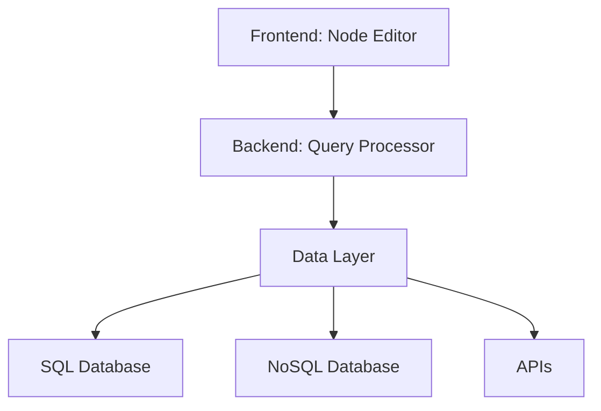

# Vision for the Node-Based Query System

## Introduction

The vision for the node-based query system is to create a powerful, intuitive, and accessible platform for data querying and manipulation. We aim to empower users of all technical abilities to interact with complex data sources without writing a single line of code. By providing a visual, drag-and-drop interface, we will democratize data access and analysis.

## Core Principles

*   **Simplicity**: The system should be easy to learn and use, even for non-technical users.
*   **Flexibility**: The system should be able to handle a wide variety of data sources and query types.
*   **Extensibility**: The system should be designed to be easily extended with new features and functionality.
*   **Integration**: The system should seamlessly integrate with our existing products and workflows.

## High-Level Architecture

The system will be composed of three main layers:

1.  **Frontend**: A web-based user interface built with a modern JavaScript framework. This layer will provide the visual node editor and user interaction components.
2.  **Backend**: A server-side application that will handle the processing of query graphs, data retrieval, and integration with external systems.
3.  **Data Layer**: A flexible data abstraction layer that will allow the system to connect to a variety of data sources, such as SQL databases, NoSQL databases, and APIs.

## Target Audience

The primary target audience for this system is data analysts, business users, and developers who need to perform complex data queries but may not have the technical expertise to write SQL or other query languages.

## Success Metrics

The success of the node-based query system will be measured by the following metrics:

*   **User Adoption**: The number of active users of the system.
*   **User Satisfaction**: Feedback from users on the ease of use and functionality of the system.
*   **Time to Value**: The time it takes for a new user to create a meaningful query.